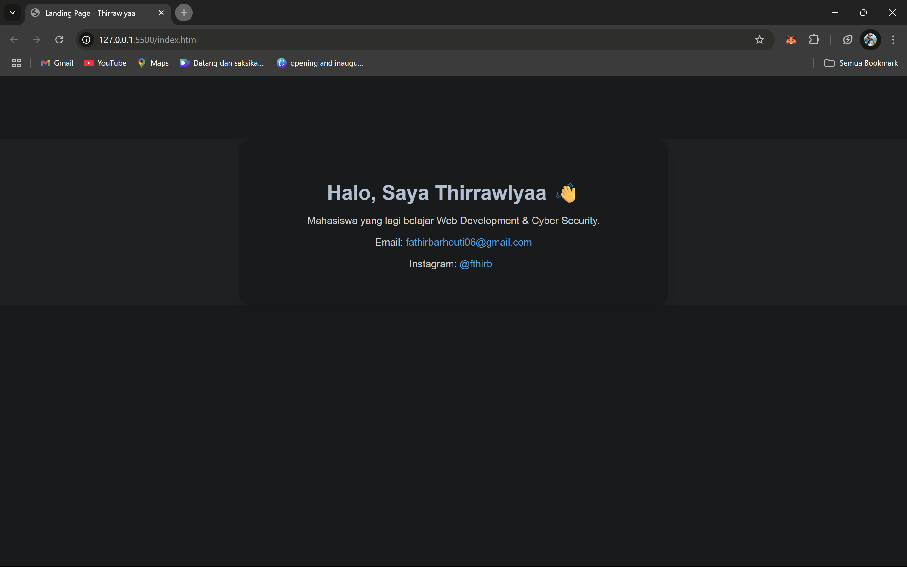

# 🌐 Landing Page – Thirrawlyaa

Ini adalah project landing page pribadi yang gua bikin buat latihan dasar HTML dan CSS. Tujuannya simpel: belajar bikin halaman statis dari nol, sambil ngerti struktur dan styling-nya.

---

## ✍️ Tentang Project

Gua masih belajar dan ngulik-ngulik sendiri, jadi ini lebih ke arah eksplorasi daripada produk jadi. Tapi dari project ini, gua belajar:

- Ngelayout halaman pake HTML
- Styling dasar pake CSS
- Cara nyambungin file CSS ke HTML
- Cara kerja elemen-elemen dasar seperti heading, paragraph, dll

---

## 🔧 Tools yang Dipakai

- HTML
- CSS
- Visual Studio Code
- Google Chrome buat preview

---

## 📷 Preview (Optional)

---

## 🚀 Cara Pakai

1. Download atau clone repository ini
2. Buka file `index.html` di browser
3. Done!

---

## 📌 Catatan Tambahan

Ini masih basic banget, tapi gua ngerasa penting buat mulai dari bawah. Gua bakal upgrade pelan-pelan dan belajar buat nambahin JavaScript dan responsive layout ke depannya.

---

© 2025 – Thirrawlyaa (Fathir Barhouti)
